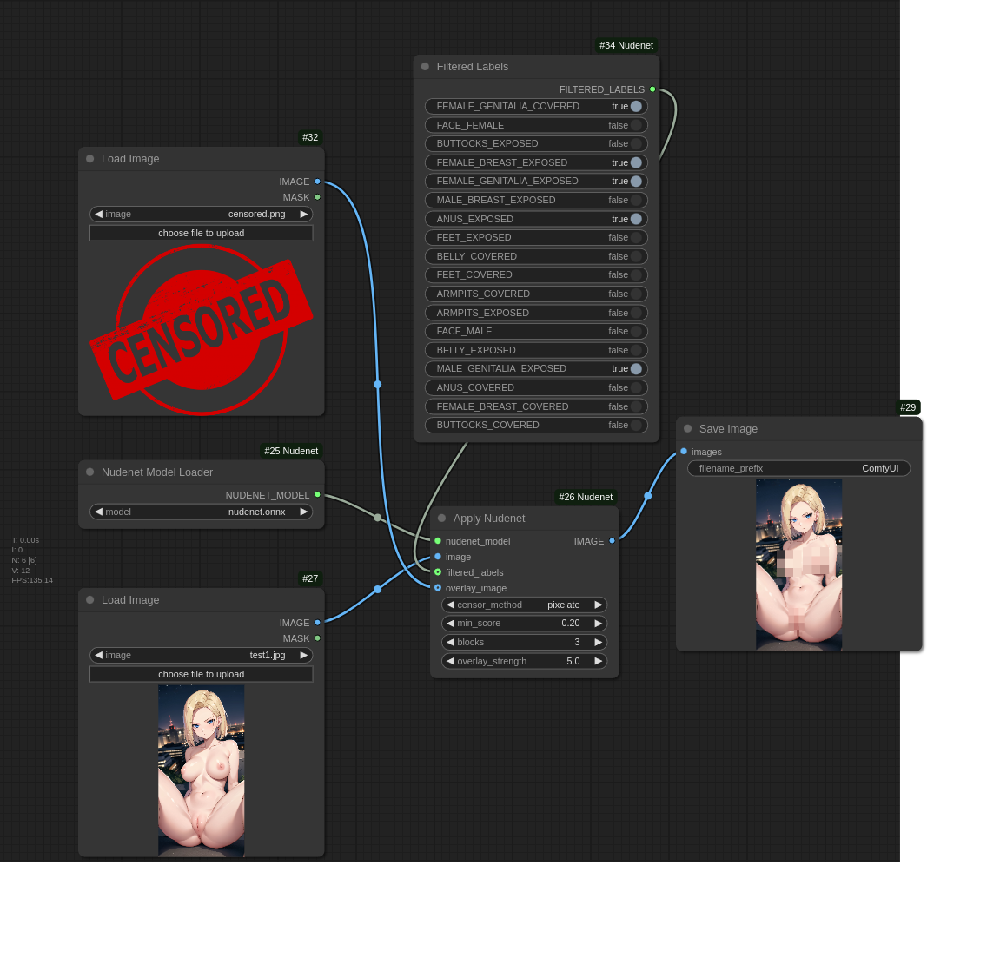

# ComfyUI-Nudenet

Nodes for NSFW content filtering. 

Implementation is base on [notAI-tech/NudeNet](https://github.com/notAI-tech/NudeNet) and [vladmandic/sd-extension-nudenet](https://github.com/vladmandic/sd-extension-nudenet)


# Features

- Simple integration with ComfyUI workflow
- Exposure filtering with customizable thresholds

# Installation

1. Clone this repository into your ComfyUI custom nodes directory:

```bash
cd ComfyUI/custom_nodes/
git clone https://github.com/phuvinh010701/ComfyUI-NudeNet
```

2. Install required dependencies

```bash
pip install -r requirements.txt
```

3. Create folder, download models
Download model from [here](https://d2xl8ijk56kv4u.cloudfront.net/models/nudenet.onnx)
 and put into models/Nudenet/

# Available Nodes

## NudenetModelLoader
Loads and initializes the NudeNet ONNX model.

- Inputs:

    model: Select from available NudeNet models in the models directory

- Outputs:

    NUDENET_MODEL: Initialized model for use in other nodes

## FilteredLabel
Configure which labels to filter in the detection process.

- Inputs:

    Multiple boolean toggles for each available label in LABELS_CLASSIDS_MAPPING
    Each label can be enabled (True) or disabled (False)

- Outputs:

    FILTERED_LABELS: List of enabled label class IDs for filtering

## ApplyNudenet
Applies NSFW content filtering to images.

- Required Inputs:

    nudenet_model (NUDENET_MODEL): Loaded NudeNet model \
    image (IMAGE): Input image to process \
    censor_method: Method for censoring detected areas \
    filtered_labels (FILTERED_LABELS): Labels to filter from FilteredLabel node \
    min_score (FLOAT): Detection confidence threshold (0.0 - 1.0, default: 0.2) \
    blocks (INT): Number of blocks for pixelation (1 - 100, default: 3)

- Optional Inputs:

    overlay_image (IMAGE): Image to use as overlay for censoring \
    overlay_strength (FLOAT): Strength of the overlay effect (0.0 - 10.0, default: 1.0)

- Outputs:

    IMAGE: Processed image with applied filtering

## Usage Example
Using example workflow from ./example/nudenet_base_example.json
Or drag and drop this image into ComfyUI



## Contributing
Contributions are welcome! Please feel free to submit a Pull Request.